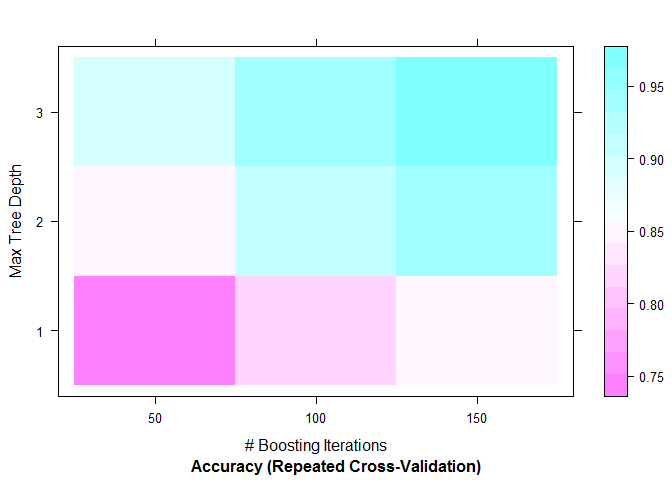

# Practical Machine Learning Project
William F. Nicodemus  
Sept 20, 2015  

```r
library(knitr);library(ggplot2);library(questionr);library(caret) ; library(kernlab)
opts_chunk$set(message = FALSE,echo = TRUE, warning=FALSE)
```
##Synopsis##  

A random forest and a gradient boosting machine learning models were built to predict whether weightlifters are performing barbell lifts correctly. The models were trained on data gathered from six individuals wearing body accelerometers and doing barbell lifts in five different ways, one correctly and four incorrectly. The final model is tested against a validation dataset consisting of twenty test cases. The goal is to predict in which of the five different ways the lift can be performed each test falls in.

More information is available from the website: http://groupware.les.inf.puc-rio.br/har 

## Loading the data ##  

There are two datasets to download and read into the program. The second dataset, pml-testing, is renamed pml_validate to avoid confusing it with the testing dataset created from partitioning the pml-training dataset.


```r
setwd("C:/Users/william/Documents/R/ML")
fileUrl1 <- "https://d396qusza40orc.cloudfront.net/predmachlearn/pml-training.csv"
# download.file(fileUrl1, destfile = "pml-training.csv")
fileUrl2 <- "https://d396qusza40orc.cloudfront.net/predmachlearn/pml-testing.csv"
# download.file(fileUrl2, destfile = "pml-testing.csv")
pml_train <- read.csv("pml-training.csv",stringsAsFactors = F, na.strings = c("NA", "","#DIV/0!"))
pml_validate <- read.csv("pml-testing.csv",stringsAsFactors = F, na.strings = c("NA", "","#DIV/0!"))
cat("Train/Test Dataset Dimension:",dim(pml_train))
```

```
## Train/Test Dataset Dimension: 19622 160
```

```r
cat("Validation Dataset Dimension:",dim(pml_validate))
```

```
## Validation Dataset Dimension: 20 160
```

##Preprocess Data##

Thera are 160 variables in the dataset including the response variable, classe, coded as A, B, C, D, E where A is the lift performed correctly. The model may use any or all of the 159 predictor variables.

###Data Cleaning###

There are 75 variables eliminated because 98% of their values are either missing or invalid. These entries were read as NA strings when the dataset was loaded. In addition, the first seven columns are also eliminated because they are related to the person doing the lift and the time of the measurement and are not accelerometer variables measuring movement.  
The remaining 52 predictor variables were checked for unique values and there were no zero variance predictors. 


```r
NAfreq<-freq.na(pml_train,names(pml_train))
NAnames<-rownames(NAfreq[NAfreq[,2]>97,])
pml_train<-pml_train[,-which(colnames(pml_train) %in% NAnames) ]
pml_train<-pml_train[,-c(1:7)]
cat("Train/Test Dataset Dimension:",dim(pml_train))
```

```
## Train/Test Dataset Dimension: 19622 53
```

```r
nsv <- nearZeroVar(pml_train,saveMetrics=TRUE)
cat("Number of near zero covariates:",sum(nsv[,c(3,4)]==T))
```

```
## Number of near zero covariates: 0
```

###Transforming Predictors###

Virtually all the predictor variables are quite skewed. The data was first centered and scaled, then a Yeo-Johnson transformation was made, and finally the number of predictors was reduced using principal component analysis. However, each attempt greatly reduced the accuracy of the prediction therefore no transformation was made other than the elimination of the variables with missing values described above. 

###Data Splitting###

The data is split into a training dataset containing 75% of the rows and a testing dataset containing the remaining 25%. 


```r
inTrain <- createDataPartition(y=pml_train$classe, p=0.75, list=F)
training <- pml_train[ inTrain,]
testing <- pml_train[-inTrain,]
# training$classe<-as.factor(training$classe)
rm(pml_train)
```

##Modeling##  

A gradient boosted machine model and a forest tree model are selected as they are suited for multi-classification response models. Since these algorithms have high accuracy but are prone to overfitting the training data, a 5-fold repeated cross-validation with 3 repeats resampling scheme is used in both models to reduce the risk of overfitting,. 


```r
set.seed(12345)
traincntl<-trainControl(method="repeatedcv",number = 5,repeats=3)
```

###Gradient Boosted Machine###  

The Stochastic Gradient Boosting algorithm is applied to the training data and an accuracy of .9626 is achieved after 150 iterations with 3 splits on each tree as illustred in the level plot below.

When predicting on the testing data, the accuracy drops to .9606 thus the expected out-of-sample error is 100-96.06 = **3.94%**. Summing the diagonal elements in the confusion matrix below confirms the predicted accuracy was 96.06% given that 4711 out of a total of 4904 test cases are predicted correctly.

To run the train function on this gradient boosting model and on the random forest model, I have taken advantage of parallel computations from a dual core CPU. The  gradient boosting training took over an hour to run and the random forest took over eight hours. To run the markdown document, the fits for each model was saved in a RDS file and the Rmarkdown paramenter eval is set to false.


```r
library(doParallel)
cl <- makeCluster(detectCores())
registerDoParallel(cl)
set.seed(12345)
GBMfit <- train(training$classe ~ .,data=training,method="gbm",trControl=traincntl,verbose=F)
stopCluster(cl)
detach(package:doParallel)
saveRDS(GBMfit, "GBMmodel.RDS")
```

```r
GBMfit<-readRDS("GBMmodel.RDS")
plot(GBMfit, plotType = "level")
```

 

```r
GBMfit
```

```
## Stochastic Gradient Boosting 
## 
## 14718 samples
##    52 predictor
##     5 classes: 'A', 'B', 'C', 'D', 'E' 
## 
## No pre-processing
## Resampling: Cross-Validated (5 fold, repeated 3 times) 
## Summary of sample sizes: 11774, 11774, 11775, 11774, 11775, 11775, ... 
## Resampling results across tuning parameters:
## 
##   interaction.depth  n.trees  Accuracy   Kappa      Accuracy SD
##   1                   50      0.7508039  0.6841273  0.008600948
##   1                  100      0.8186351  0.7704965  0.005594567
##   1                  150      0.8539661  0.8152285  0.005852077
##   2                   50      0.8537392  0.8147145  0.005278273
##   2                  100      0.9068946  0.8821833  0.004848703
##   2                  150      0.9329846  0.9152012  0.003113620
##   3                   50      0.8962725  0.8687006  0.004818203
##   3                  100      0.9424741  0.9272089  0.002970159
##   3                  150      0.9625627  0.9526404  0.002835785
##   Kappa SD   
##   0.011020792
##   0.007088926
##   0.007385127
##   0.006691608
##   0.006111321
##   0.003943169
##   0.006086561
##   0.003749632
##   0.003589534
## 
## Tuning parameter 'shrinkage' was held constant at a value of 0.1
## 
## Tuning parameter 'n.minobsinnode' was held constant at a value of 10
## Accuracy was used to select the optimal model using  the largest value.
## The final values used for the model were n.trees = 150,
##  interaction.depth = 3, shrinkage = 0.1 and n.minobsinnode = 10.
```

```r
GBMpredict <- predict(GBMfit, testing)
GBMconfusion <- confusionMatrix(GBMpredict, testing$classe)
GBMconfusion
```

```
## Confusion Matrix and Statistics
## 
##           Reference
## Prediction    A    B    C    D    E
##          A 1381   21    0    0    0
##          B    7  916   24    2    3
##          C    6   12  821   18    7
##          D    0    0   10  776   13
##          E    1    0    0    8  878
## 
## Overall Statistics
##                                           
##                Accuracy : 0.9731          
##                  95% CI : (0.9682, 0.9774)
##     No Information Rate : 0.2845          
##     P-Value [Acc > NIR] : < 2.2e-16       
##                                           
##                   Kappa : 0.9659          
##  Mcnemar's Test P-Value : NA              
## 
## Statistics by Class:
## 
##                      Class: A Class: B Class: C Class: D Class: E
## Sensitivity            0.9900   0.9652   0.9602   0.9652   0.9745
## Specificity            0.9940   0.9909   0.9894   0.9944   0.9978
## Pos Pred Value         0.9850   0.9622   0.9502   0.9712   0.9899
## Neg Pred Value         0.9960   0.9916   0.9916   0.9932   0.9943
## Prevalence             0.2845   0.1935   0.1743   0.1639   0.1837
## Detection Rate         0.2816   0.1868   0.1674   0.1582   0.1790
## Detection Prevalence   0.2859   0.1941   0.1762   0.1629   0.1809
## Balanced Accuracy      0.9920   0.9781   0.9748   0.9798   0.9861
```

###Random Forest###

A random forest is an estimator that fits a number of decision tree classifiers on various sub-samples of the dataset and use averaging to improve the predictive accuracy and control over-fitting. 

The in-sample accuracy of this model increases to 99.37% when the number of features randomly selected for each tree is optimized at mtry=27. The accuracy and kappa metrics are ploted below.

The out-of-sample accuracy from the confusion matrix of predictors increases to 99.37% and the out-of-sample error is 31 rows out of 4904 or **.63%**.


```r
library(doParallel)
cl <- makeCluster(detectCores())
registerDoParallel(cl)
set.seed(12345)                      
RFfit <- train(classe ~., data=training, method="rf", trControl=traincntl,prox=T)
stopCluster(cl)
detach(package:doParallel)
saveRDS(RFfit, "RFmodel.RDS")
```

```r
require(gridExtra)
RFfit<-readRDS("RFmodel.RDS")
grid.arrange(plot(RFfit,metric = "Accuracy"), plot(RFfit, metric = "Kappa"), ncol=2)
```

 

```r
RFfit
```

```
## Random Forest 
## 
## 14718 samples
##    52 predictor
##     5 classes: 'A', 'B', 'C', 'D', 'E' 
## 
## No pre-processing
## Resampling: Cross-Validated (5 fold, repeated 3 times) 
## Summary of sample sizes: 11774, 11774, 11775, 11774, 11775, 11775, ... 
## Resampling results across tuning parameters:
## 
##   mtry  Accuracy   Kappa      Accuracy SD  Kappa SD   
##    2    0.9916429  0.9894276  0.001814766  0.002296050
##   27    0.9916655  0.9894568  0.001769708  0.002238739
##   52    0.9841009  0.9798868  0.003418158  0.004325322
## 
## Accuracy was used to select the optimal model using  the largest value.
## The final value used for the model was mtry = 27.
```

```r
RFpredict <- predict(RFfit, testing)
RFconfusion <- confusionMatrix(RFpredict, testing$classe)
RFconfusion
```

```
## Confusion Matrix and Statistics
## 
##           Reference
## Prediction    A    B    C    D    E
##          A 1394    5    0    0    0
##          B    1  944    2    0    0
##          C    0    0  851    0    0
##          D    0    0    2  804    1
##          E    0    0    0    0  900
## 
## Overall Statistics
##                                          
##                Accuracy : 0.9978         
##                  95% CI : (0.996, 0.9989)
##     No Information Rate : 0.2845         
##     P-Value [Acc > NIR] : < 2.2e-16      
##                                          
##                   Kappa : 0.9972         
##  Mcnemar's Test P-Value : NA             
## 
## Statistics by Class:
## 
##                      Class: A Class: B Class: C Class: D Class: E
## Sensitivity            0.9993   0.9947   0.9953   1.0000   0.9989
## Specificity            0.9986   0.9992   1.0000   0.9993   1.0000
## Pos Pred Value         0.9964   0.9968   1.0000   0.9963   1.0000
## Neg Pred Value         0.9997   0.9987   0.9990   1.0000   0.9998
## Prevalence             0.2845   0.1935   0.1743   0.1639   0.1837
## Detection Rate         0.2843   0.1925   0.1735   0.1639   0.1835
## Detection Prevalence   0.2853   0.1931   0.1735   0.1646   0.1835
## Balanced Accuracy      0.9989   0.9970   0.9977   0.9996   0.9994
```
##Model Selection##

The accuracy and kappa metrics favor the **random forest** fit. To verify this and given that both models were run with the same seed, the caret function resamples is run and the results are illustrated below in a lattice box-and-whisker plot.

In addition to having a lower out-of-sample error, the random forest fit produced higher accuracy and kappa values on all quantiles displayed in the summary statistic. 


```r
resamps <- resamples(list(rf=RFfit,gbm=GBMfit))
summary(resamps)
```

```
## 
## Call:
## summary.resamples(object = resamps)
## 
## Models: rf, gbm 
## Number of resamples: 15 
## 
## Accuracy 
##       Min. 1st Qu. Median   Mean 3rd Qu.   Max. NA's
## rf  0.9881  0.9905 0.9922 0.9917  0.9927 0.9939    0
## gbm 0.9582  0.9604 0.9626 0.9626  0.9643 0.9674    0
## 
## Kappa 
##       Min. 1st Qu. Median   Mean 3rd Qu.   Max. NA's
## rf  0.9850  0.9880 0.9901 0.9895  0.9908 0.9923    0
## gbm 0.9472  0.9499 0.9527 0.9526  0.9549 0.9587    0
```

```r
bwplot(resamps,main="RandomForest vs Gradient Boosting)")
```

 

##Model Testing##  

The random forest model is tested against the 20 test cases stored in pml_validate and is formatted as required by the project submission.


```r
answer<-predict(RFfit,newdata=pml_validate)
pml_write_files = function(x){
  n = length(x)
  for(i in 1:n){
    filename = paste0("problem_id_",i,".txt")
    write.table(x[i],file=filename,quote=FALSE,row.names=FALSE,col.names=FALSE)
  }
}
pml_write_files(answer)
```

##References##

[1] https://topepo.github.io/caret/featureselection.html  
[2] https://topepo.github.io/caret/training.html  
[3] https://www.quora.com/How-do-random-forests-and-boosted-decision-trees-compare  
